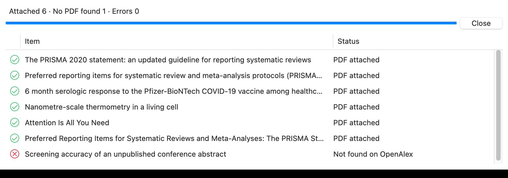
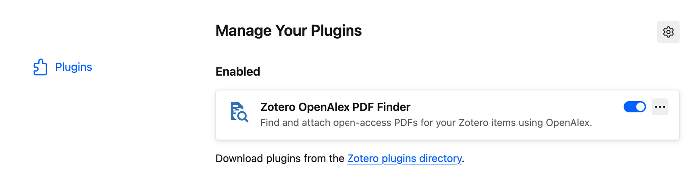
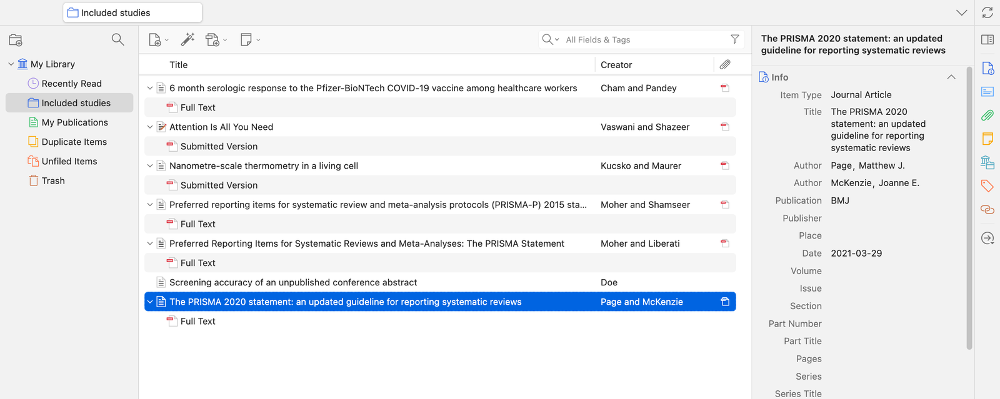
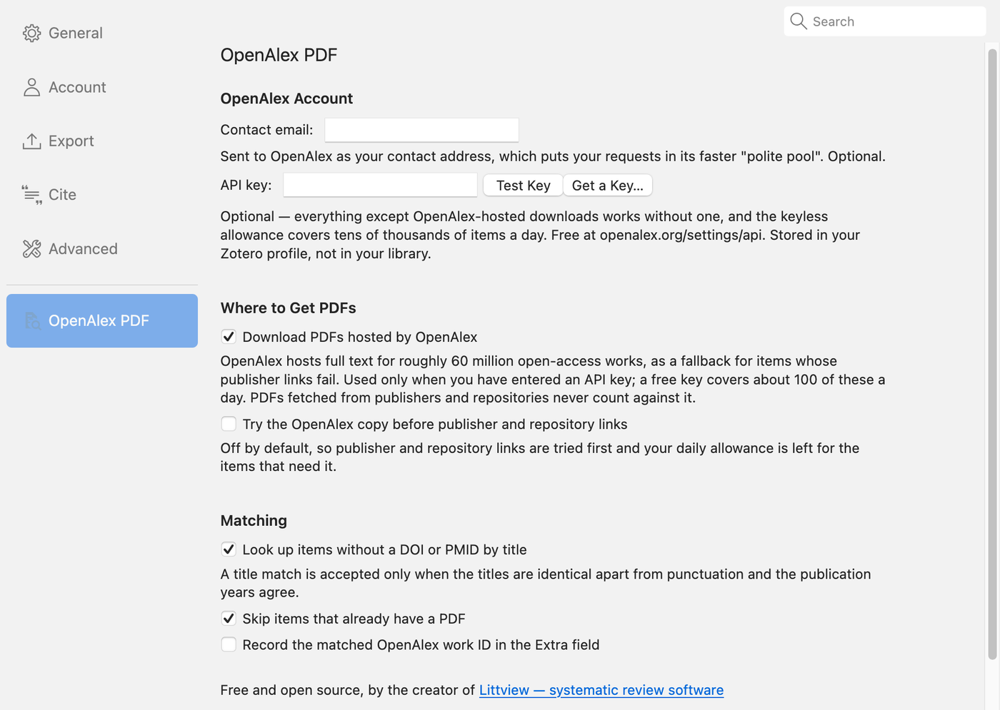

# OpenAlex PDF Finder for Zotero

**Select references in Zotero, right-click, and get their PDFs attached — free, no account needed.**

The plugin looks each reference up in [OpenAlex](https://openalex.org), the open catalog of
250+ million scholarly works, finds a legal open-access copy (publisher, PubMed Central,
arXiv, institutional repositories), and attaches it to the item.

Made for literature reviews: you've just imported 300 references from a database search
and you need the PDFs behind them.

  <a href="https://github.com/Littview/zotero-openalex-pdf/releases/latest/download/zotero-openalex-pdf.xpi"><b>⬇ Download the plugin (.xpi)</b></a>
  &nbsp;·&nbsp; Works with Zotero 7, 8, 9 and 10 &nbsp;·&nbsp; Free and open source

---

## Install (1 minute)

1. **Download** [`zotero-openalex-pdf.xpi`](https://github.com/Littview/zotero-openalex-pdf/releases/latest/download/zotero-openalex-pdf.xpi).
   > Using **Firefox**? Right-click the link and choose **Save Link As…**. A plain click
   > makes Firefox try to install it as a Firefox add-on, which won't work.
2. In Zotero, open **Tools → Plugins**.
3. **Drag the `.xpi` file into that window.** (Or click the gear icon ⚙ → **Install
   Plugin From File…** and pick it.)

That's it. No restart, no account, no API key. You should see it in the list:

Zotero checks for new versions of the plugin automatically.

> **Upgraded Zotero and the menu item disappeared?** Version 0.1 only supported
> Zotero 9, so newer Zotero switched it off. Download the file above and install it the
> same way. It replaces the old version, and from 0.3 on it keeps working across Zotero
> updates.

## Use it

1. Select one or many items in your library (**Cmd/Ctrl + A** selects the whole collection).
2. **Right-click → Find PDF via OpenAlex.**
   You can also use the menu bar: **Tools → Find PDFs via OpenAlex**.
3. A window lists every item and what happened to it. You can keep working while it runs,
   and **Cancel** stops it after the current item.

PDFs land in your library like any other attachment, under the item they belong to:

Items that already have a PDF are skipped, so it's safe to run it on the whole collection
again later.

### What the results mean

| Status | Meaning |
| --- | --- |
| **PDF attached** | Done. |
| **Not found on OpenAlex** | OpenAlex has no record matching the DOI, PMID or title. Common for conference abstracts, grey literature and very recent items. |
| **No full text available** | The work was found, but no open-access copy exists. It's probably paywalled. |
| **No PDF could be downloaded** | Open-access links exist, but they didn't return a PDF. Publisher sites sometimes block downloads. |
| **Possible match rejected — the years disagree** | A work with exactly this title exists, but in a different year. Check it by hand; the plugin won't guess. |

## Questions

**Is it really free? Do I need an OpenAlex API key?**
No key, no account, no cost. A 1,000-reference review uses about 20 lookups, and the
free allowance is about 1,000 lookups a day. PDFs come straight from publishers and
repositories and don't count against anything. A free key is only useful if you want
OpenAlex's own PDF copies as an extra fallback (see [Settings](#settings)).

**Will it attach the wrong paper?**
It's built not to. DOI, PMID and arXiv matches are exact. A title-only match is accepted
only when the title is identical (ignoring punctuation and capitals) **and** the year is
within one year. Anything less is reported, never attached.

**How is this different from Zotero's built-in "Find Available PDF"?**
Zotero's built-in lookup relies mainly on the DOI. This plugin also finds papers by **PMID**, by
**arXiv ID**, and by **exact title** when there's no identifier at all, which is common
in exports from databases like Scopus, Web of Science or Ovid. It also searches every
copy OpenAlex knows about. Run both: Zotero's first, then this on whatever is still
missing.

**What about paywalled papers?**
It only uses copies that are legally free to read. As a last resort it tries the
publisher's page, which can work if you're on a campus network with IP-based access.

**What data leaves my computer?**
The DOIs, PMIDs and titles of the items you select are sent to OpenAlex to look them up.
Nothing else, and nothing from your library is stored anywhere.

## Settings

**Zotero → Settings → OpenAlex PDF** (on Windows/Linux: **Edit → Settings**). Every
setting is optional; the defaults are fine for most people.

| Setting | What it does |
| --- | --- |
| **Contact email** | Sent to OpenAlex so your requests go to its faster "polite pool". |
| **API key** | Free at [openalex.org/settings/api](https://openalex.org/settings/api). Unlocks OpenAlex-hosted PDFs (~60 million works, ~100 downloads/day free) as a fallback when publisher links fail. **Test Key** checks it. |
| **Download PDFs hosted by OpenAlex** | Use those hosted copies when you have a key. |
| **Try the OpenAlex copy first** | Uses your hosted-PDF allowance before trying free links. Off by default. |
| **Look up items without a DOI or PMID by title** | The strict title match described above. |
| **Skip items that already have a PDF** | Turn off to add a second copy. |
| **Record the matched OpenAlex work ID in Extra** | Writes `OpenAlex: W1234567890` into the item's Extra field. |

## Troubleshooting

- **No "Find PDF via OpenAlex" in the right-click menu.** Open **Tools → Plugins**
  and check that the plugin is listed and switched on. If it says it's incompatible
  with your Zotero version, [download the latest version](https://github.com/Littview/zotero-openalex-pdf/releases/latest).
  The menu item is hidden when only standalone notes are selected.
- **"OpenAlex rate limit reached".** You've used the day's free lookups (it resets at
  midnight UTC). Wait, or add a free API key.
- **Something else.** Turn on **Help → Debug Output Logging**, run the plugin again,
  then **Help → Debug Output Logging → View Output**. Lines starting with
  `[OpenAlex PDF Finder]` are this plugin's. Please
  [open an issue](https://github.com/Littview/zotero-openalex-pdf/issues) with them.

## Requirements

Zotero 7 or later (tested on 7.0, 8.0, 9.0 and 10.0), on macOS, Windows or Linux.

## Credits

Metadata and full-text links come from [OpenAlex](https://openalex.org), run by the
non-profit [OurResearch](https://ourresearch.org). If OpenAlex saves you time, consider
supporting them.

Developers: see [CONTRIBUTING.md](CONTRIBUTING.md) to build from source or help out.
Licensed under [MIT](LICENSE).

---

Built by **[Littview](https://www.littview.com/?utm_source=github&utm_medium=readme&utm_campaign=zotero-openalex-pdf)**,
systematic review software with AI assistance for screening, extraction and reporting.
